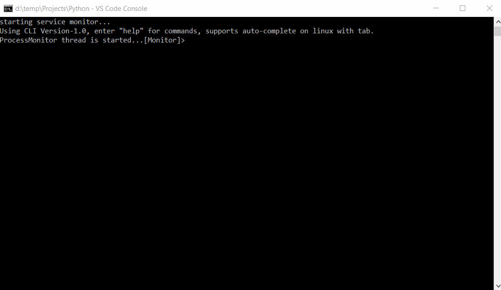
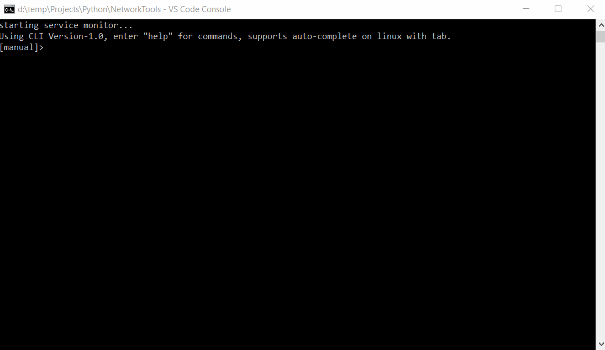
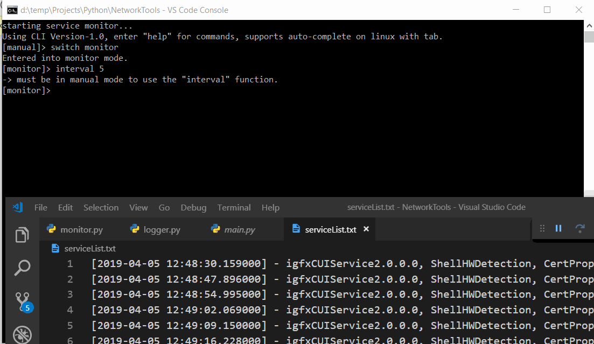
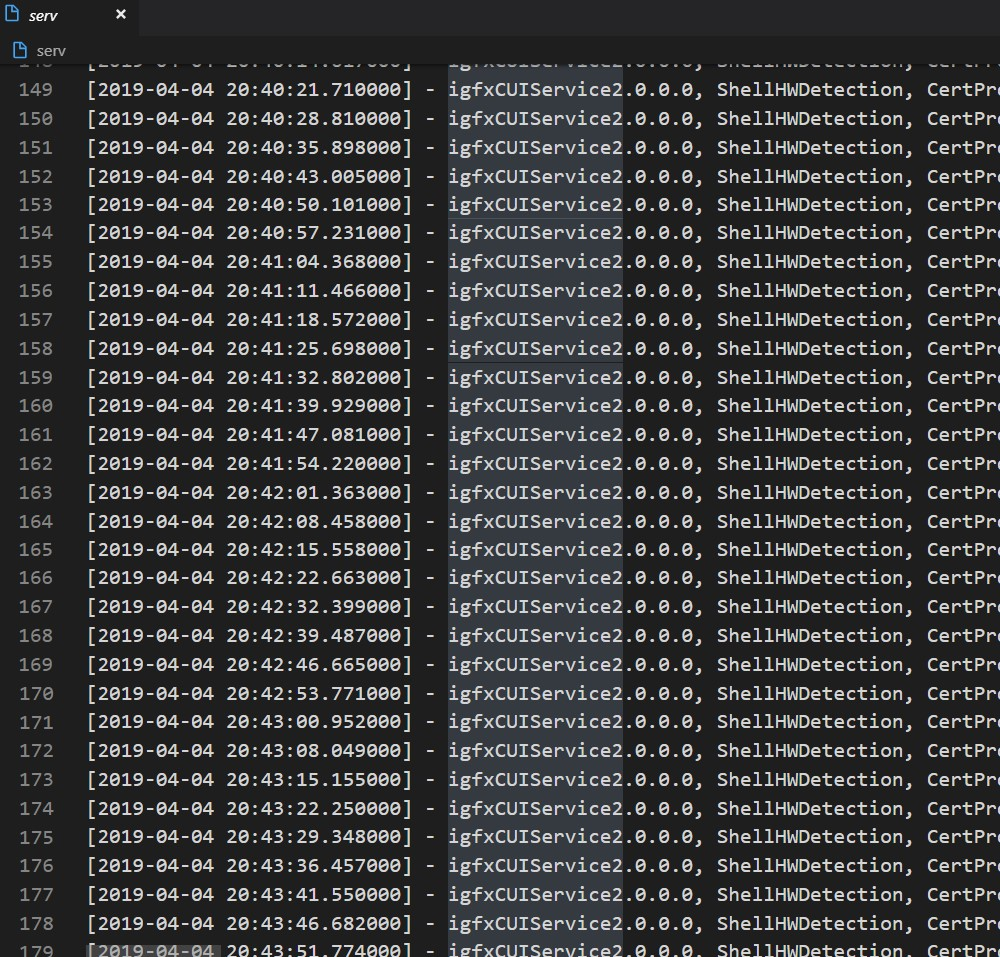
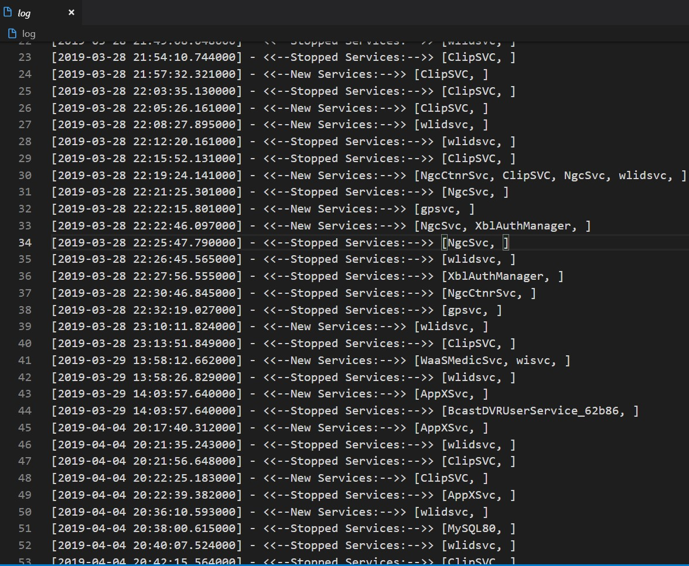
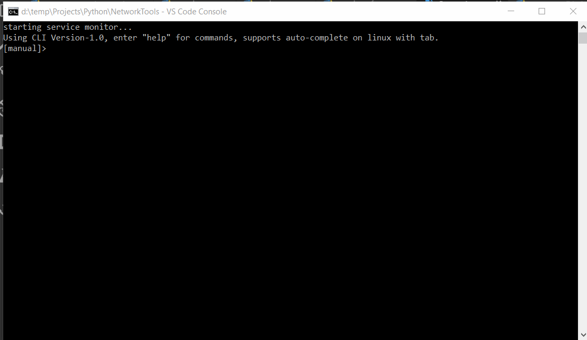

# PythonNetworkTools
Python codes for basic port scanning (a nmap dummy) and SSH password guessing script.

## Port Scanning
The documentation and syntax can be found on the file script itself along with its dependencies.

## Password Guessing
The documentation and syntax can be found on the file script itself along with its dependencies.

## Service Monitor

### What is it?
Service monitor is a python program which monitors the services on the host computer, it  scans the services every now and then and the time interval between scans can be configured.

### Features
- service scanning every X time.
    - the time interval between scans can be configured
    - logs every scan event to a log file.
    - logs every change in services status to a different log file.
- Tool Protection: alert on an outside modification of log files.
- Command Line Interface (CLI)
    - auto-complete commands using TAB key (Linux only)
    - show available commands using TAB-TAB combination (Linux only)
    - "help" command and command description, syntax and examples info.

### How to run
Download the required files for the program found in the service_monitor directory and run the file "main.py", The monitor scans by default every 7 seconds and can be changed with the "interval" command in the CLI, The scan auto-start on program execution.

### Supported platforms
- Linux (Tested on Ubuntu 18.04)
- Windows (Tested on Windows 10 april 2019 update)

### Python Version
The program requires Python 2.7.

### Changelog
- Date: 07/04/2019 - Version 1.1.
    - Separated defensive system from the logger, improving integrating its defences in other parts of the program.
    - added a flag '-log' to diff function to search inside the status log file instead of the servicelist.
    - bug fixes
- Date: 28/03/2019 - Version 1.0.
    - Initial release

### Dependencies and modules
- psutil v5.6.1 (for windows only, needed for service list scanning)
- cmd (standard library of python 2.7, the CLI)
- subprocess (standard library of python 2.7, for linux only)
- re (standard library of python 2.7, regular expressions for parsing command line arguments)
- Threading (standard library of python 2.7)
- datetime (standard library of python 2.7)

### Screenshots
#### Monitor mode demonstration

#### Unauthurized modification detection

#### Service List text log file.

#### Status (changes) text log file.

#### 'diff' function

#### 'diff' function with log - review events between two dates from status log file.

